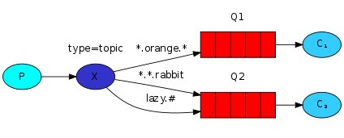

# AMQP Publish Subscribe with Topics

Using a fanout exchange is only capable of dummy broadcasting.
Using the direct exchange still has limitations - it can't do routing based on multiple criteria.
In our logging system we might want to subscribe to not only logs based on severity, but also based on the source which emitted the log.

### Topic exchange
Messages sent to a topic exchange can't have an arbitrary routing_key - it must be a list of words, delimited by dots.
The words can be anything, but usually they specify some features connected to the message.
A few valid routing key examples:
`stock.usd.nyse`
`nyse.vmw`
`quick.orange.rabbit`

There can be as many words in the routing key as you like, up to the limit of 255 bytes.

The binding key must also be in the same form.
The logic behind the topic exchange is similar to a direct one - a message sent with a particular routing key will be delivered to all the queues that are bound with a matching binding key.
However there are two important special cases for binding keys:

- \* (star) can substitute for exactly one word.
- \# (hash) can substitute for zero or more words.

When a queue is bound with `#` (hash) binding key - it will receive all the messages, regardless of the routing key - like in fanout exchange.
When special characters `*` (star) and `#` (hash) aren't used in bindings, the topic exchange will behave just like a direct one.

In this example, we're going to send messages which all describe animals.
The messages will be sent with a routing key that consists of three words (two dots).
The first word in the routing key will describe speed, second a colour and third a species: `<speed>.<colour>.<species>`

We created three bindings: Q1 is bound with binding key `*.orange.*` and Q2 with `*.*.rabbit` and `lazy.#`
These bindings can be summarised as:

- Q1 is interested in all the orange animals.
- Q2 wants to hear everything about rabbits, and everything about lazy animals.

----
### Testing

To receive all logs:
`node subscribe "#"`
To receive all logs from facility <b>kern</b>
`node subscribe kern`
To receive only critical logs
`node subscribe "*.critical"`

To emit a log with a routing key "kern.critical" type:
`node publish "kern.critical" "A critical kernel error"`
Also try this and other messages
`node publish "kern" "Kern log"`

Detail tutorial can be found here https://www.rabbitmq.com/tutorials/tutorial-five-javascript.html
